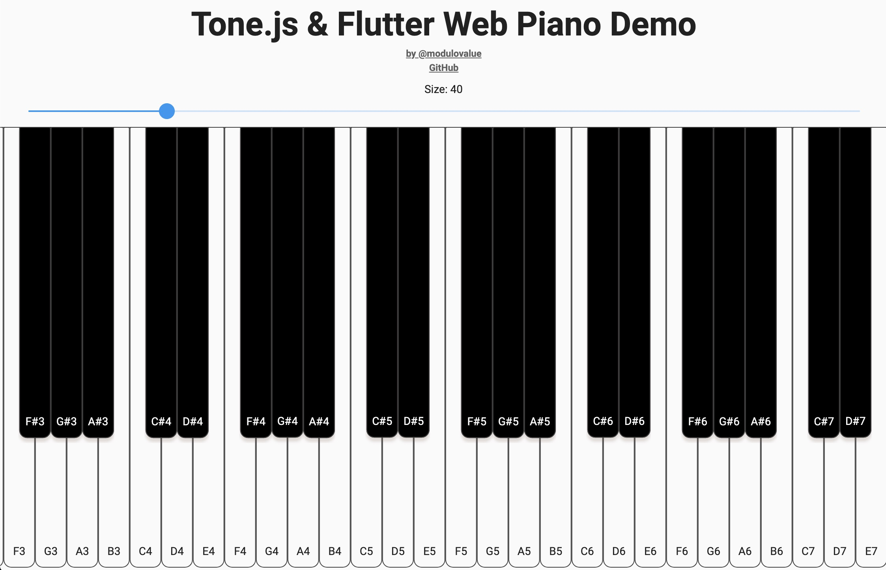

# Tone.js meets Flutter Web (A simple piano demo)
[](https://github.com/modulovalue/tonejs_meets_flutterweb/blob/master/LICENSE) [](https://github.com/modulovalue/tonejs_meets_flutterweb) [](https://twitter.com/modulovalue) [](https://github.com/modulovalue)

A quick and dirty demo on how to use a javascript library with Flutter Web

[tonejs_meets_flutterweb](https://modulovalue.com/tonejs_meets_flutterweb) (Please use Google Chrome)




## How to use JavaScript in your Flutter Web App. (It's really easy)
1. Add the Javascript to your web/index.html

(In this case tone.js)
```html
...
<body>
  <script src="https://cdnjs.cloudflare.com/ajax/libs/tone/14.4.9/Tone.js" type="application/javascript"></script>
  <script src="main.dart.js" type="application/javascript"></script>
  <script>
    function playNote(note, duration) {
      var synth = new Tone.Synth().toDestination();
      synth.triggerAttackRelease(note, duration);
    }
  </script>
</body>
...
```

2. Call your Javascript in Dart

```dart
import 'dart:js' as js;
...
js.context.callMethod("playNote", ["C5", "8n"])
```

Easy!